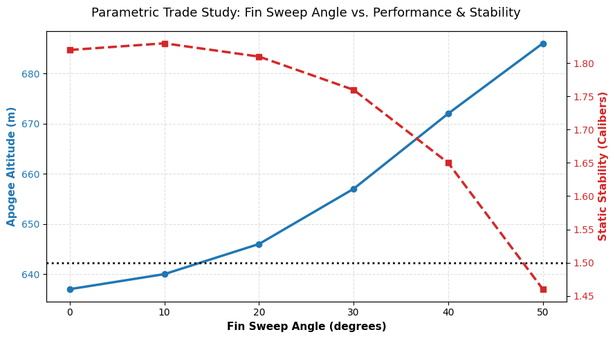

# openrocket-fin-trade-study
Parametric analysis evaluating rocket fin sweep angle vs. apogee altitude and static stability using OpenRocket and Python.

# OpenRocket Fin Sweep Parametric Trade Study

## Project Overview
This project is a aerodynamic trade study to evaluate the impact of fin sweep angle on rocket flight performance and stability. Using OpenRocket for flight dynamics simulation and Python for data processing and visualization, this study identifies the optimal fin geometry that maximizes apogee altitude while compling to minimum static stability safety thresholds ($\ge 1.5\text{ calibers}$).

---

## Key Engineering Insights & Trade-Offs
* **Aerodynamic Drag vs. Sweep Angle:** Increasing the fin sweep angle from $0^\circ$ to $50^\circ$ reduced aerodynamic drag, yielding an increase in apogee altitude from $637\text{ m}$ to $686\text{ m}$ ($+7.7\%$).
* **Stability Degradation:** Sweeping the fins shifted the aerodynamic Center of Pressure (CP) forward relative to the Center of Gravity (CG), reducing static stability from $1.82\text{ cal}$ down to $1.46\text{ cal}$.
* **Optimal Design Decision:** At a $50^\circ$ sweep, stability drops below the standard $1.5\text{ cal}$ safety threshold. The **$40^\circ$ sweep configuration** was selected as optimal, delivering a $672\text{ m}$ apogee ($+5.5\%$ over baseline) while preserving a safe static stability margin of $1.65\text{ cal}$.

---

## Simulation Data Summary

| Fin Sweep Angle ($^\circ$) | Static Stability ($\text{cal}$) | Apogee Altitude ($\text{m}$) | Max Velocity ($\text{m/s}$) | Status |
| :---: | :---: | :---: | :---: | :---: |
| 0 | 1.82 | 637 | 189 | Baseline |
| 10 | 1.83 | 640 | 190 | Stable |
| 20 | 1.81 | 646 | 190 | Stable |
| 30 | 1.76 | 657 | 191 | Stable |
| **40** | **1.65** | **672** | **192** | **Optimal Configuration** |
| 50 | 1.46 | 686 | 192 | Marginal / Unsafe ($<1.5\text{ cal}$) |

---

## Repository Files
* `baseline_rocket.ork` — OpenRocket CAD/simulation file for the baseline design.
* `trade_study_analysis.py` — Python script using `pandas` and `matplotlib` to parse simulation results and output plot graphics.
* `fin_sweep_trade_study.png` — Generated dual-axis graph displaying apogee altitude and stability trends.

---

## Tech Stack & Tools Used
* **Simulation Software:** OpenRocket v22.02
* **Programming Language:** Python 3.x
* **Data Libraries:** `pandas`, `matplotlib`
